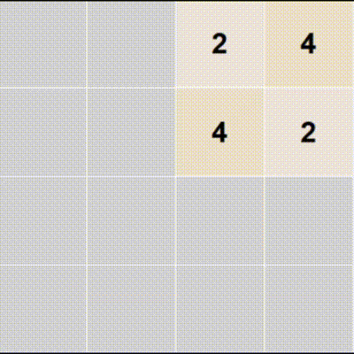

# 2048-RL-with-pytorch   
 - agent_training.py : 에이전트 훈련 스크립트
 - DQN_model.py : 에이전트 훈련 모델 (CNN)
 - Game2048.py : 2048게임 로직과 GUI (tkinter 사용)
 - simulation : 실행시 시각화      
---  
episdoe 100 (최대 128)  
      
